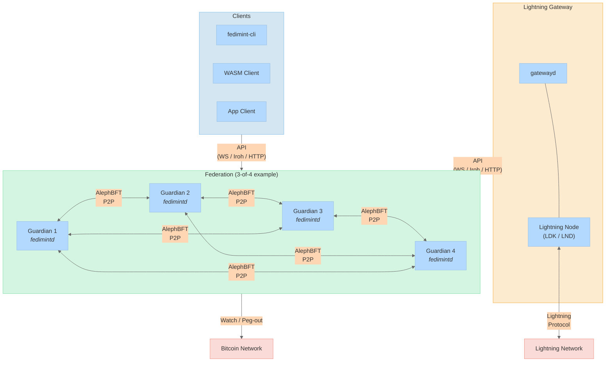
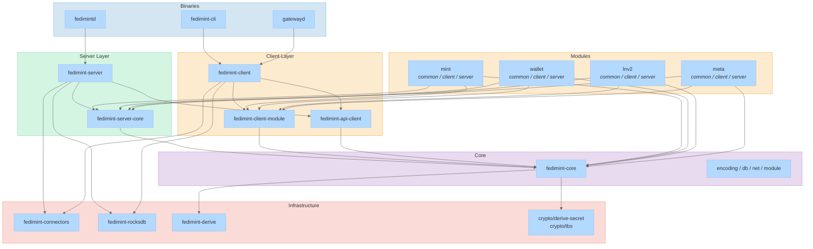

# Fedimint Architecture

Fedimint is a modular framework for building federated financial applications. Its core implementation is a federated Chaumian e-cash mint backed by Bitcoin, with Lightning Network integration for instant payments.

---

## System Overview

**Federations** are groups of guardians (typically 3-4) that jointly run BFT consensus, hold threshold key shares, and process transactions. **Clients** interact with guardians over pluggable transports. **Gateways** bridge federations to the Lightning Network.

---

## Components at a Glance

| Component | What it does | Deep dive |
|-----------|-------------|-----------|
| **Consensus** | AlephBFT-based session processing, transaction ordering, threshold signing | [consensus.md](consensus.md) |
| **Module System** | Extensible three-crate pattern for transaction types, state machines, and API endpoints | [modules.md](modules.md) |
| **Database** | Layered key-value abstraction with module isolation, optimistic transactions, and migrations | [database.md](database.md) |
| **Client** | Operation tracking, async state machines, redundant federation API queries | [client.md](client.md) |
| **Gateway** | Lightning bridge with per-federation clients, LNv2 hold-invoice payment flows | [gateway.md](gateway.md) |
| **Crypto & Encoding** | Deterministic binary encoding, HKDF secret derivation, DKG, backup/recovery | [crypto-and-encoding.md](crypto-and-encoding.md) |

---

## Crate Map

### Layer Summary

- **Binaries** -- `fedimintd` (guardian daemon), `fedimint-cli` (client CLI), `gatewayd` (Lightning gateway)
- **Server Layer** -- `fedimint-server` runs consensus and hosts the guardian API; `fedimint-server-core` defines the `ServerModule` trait
- **Client Layer** -- `fedimint-client` manages operations and state machines; `fedimint-client-module` defines the `ClientModule` trait; `fedimint-api-client` handles federation communication
- **Core** -- `fedimint-core` provides shared types, encoding, database abstractions, networking primitives, and the module registry
- **Modules** -- Each module follows a `common / client / server` three-crate split (see [modules.md](modules.md))
- **Infrastructure** -- Transport connectors (Iroh, WS, HTTP), RocksDB backend, proc-macro derives, and cryptographic primitives (threshold blind signatures, HKDF)

---

## Entry Points

| Binary | Crate | Main |
|--------|-------|------|
| `fedimintd` | `fedimintd` | `fedimintd/src/bin/main.rs` |
| `fedimint-cli` | `fedimint-cli` | `fedimint-cli/src/main.rs` |
| `gatewayd` | `fedimint-gateway-server` | `gateway/fedimint-gateway-server/src/bin/main.rs` |
