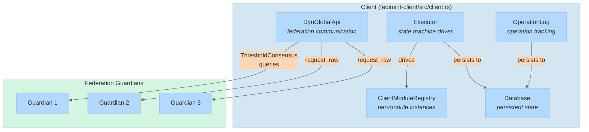
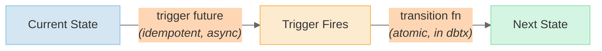
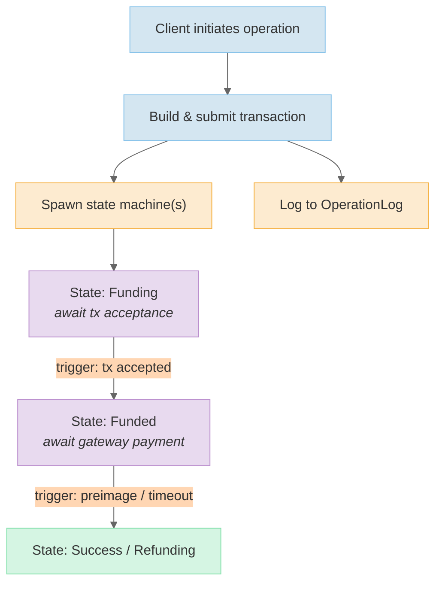

# Client Architecture

The Fedimint client manages federation interaction, module state machines, and operation tracking. It handles the complexity of communicating with multiple guardians, building balanced transactions, and driving long-running operations to completion.

[Back to overview](README.md)

---

## Client Structure



### Core Fields

| Field | Type | Purpose |
|-------|------|---------|
| `api` | `DynGlobalApi` | Federation API client for peer communication |
| `modules` | `ClientModuleRegistry` | Maps `ModuleInstanceId` to `ClientModule` instances |
| `executor` | `Executor` | Drives state machine execution and persistence |
| `operation_log` | `OperationLog` | Tracks all client operations by `OperationId` |
| `db` | `Database` | Persistent client state (module-namespaced) |
| `federation_id` | `FederationId` | Identifies the connected federation |

---

## OperationId

An `OperationId` (`fedimint-core/src/core.rs`) is a 256-bit identifier grouping correlated API requests:

```rust
pub struct OperationId(pub [u8; 32]);
```

**Purpose**: requests that the federation can already correlate (e.g. inputs and outputs in the same transaction) share an `OperationId`. This avoids the overhead of per-request anonymous connections while preserving privacy for independent operations.

**Creation**:
- `OperationId::new_random()` -- for operations with no linkable data
- `OperationId::from_encodable(data)` -- derives deterministically via SHA-256 (typically from transaction data)

All state machines, operation logs, and event logs reference operations by `OperationId`.

---

## State Machines

Client operations are driven by async state machines that survive process restarts. Each module defines its own state types (e.g. mint note issuance, Lightning contract settlement).

### State Trait

Defined in `fedimint-client-module/src/sm/state.rs`:

```rust
pub trait State: Debug + Clone + Encodable + Decodable {
    type ModuleContext;

    fn transitions(
        &self,
        context: &Self::ModuleContext,
        global_context: &DynGlobalClientContext,
    ) -> Vec<StateTransition<Self>>;

    fn operation_id(&self) -> OperationId;
}
```

### StateTransition

Each transition has two parts:



- **Trigger**: an idempotent async future (e.g. waiting for a transaction to appear in consensus, a timeout, or a federation API response). Must be safe to re-execute on restart.
- **Transition function**: a synchronous function that runs atomically within a database transaction. Updates state, never blocks.

### Executor

The `Executor` (`fedimint-client/src/sm/executor.rs`) manages the lifecycle:

1. Loads all in-progress state machines from the database on startup
2. For each active state, spawns its trigger futures
3. When a trigger fires, runs the transition function inside `db.autocommit()`
4. Persists the new state to the database
5. If the new state has transitions, continues; otherwise the state machine is terminal

This design ensures **exactly-once semantics**: if the process crashes after the trigger fires but before the transition commits, the trigger re-fires on restart (idempotent) and the transition runs again.

---

## Federation API Communication

### Transport Layer

The `ConnectorRegistry` (`fedimint-connectors/src/lib.rs`) lazily initializes transport connectors per protocol scheme:

| Transport | Scheme | Properties |
|-----------|--------|------------|
| WebSocket | `ws://`, `wss://` | Widely compatible, requires domain for TLS |
| Iroh | `iroh://` | QUIC-based, NAT-friendly, no domain needed |
| HTTP | `http://`, `https://` | Simple request/response |

Iroh uses PkaRR DHT discovery and supports hole-punching, making it ideal for self-hosted setups behind NAT.

### API Traits

**`IRawFederationApi`** (`fedimint-api-client/src/api/mod.rs`) -- peer-level communication:

```rust
pub trait IRawFederationApi {
    fn all_peers(&self) -> &BTreeSet<PeerId>;
    fn request_raw(&self, peer_id: PeerId, method: &str, params: &[Value]) -> Result<Value>;
    fn connection_status_stream(&self) -> BoxStream<PeerConnectionStatus>;
}
```

**`FederationApiExt`** -- adds redundancy strategies on top:

| Strategy | Behavior |
|----------|----------|
| `ThresholdConsensus` | Query all peers, return result agreed upon by threshold |
| Single peer | Direct request for non-consensus queries |
| `request_with_strategy(strategy, method, params)` | Generic strategy-based dispatch |

### Key API Endpoints

| Endpoint | Purpose |
|----------|---------|
| `submit_transaction` | Submit a signed transaction for consensus |
| `await_transaction` | Wait for a transaction to be accepted |
| `await_output_outcome` | Wait for an output to be processed |
| `download_backup` | Retrieve encrypted client backup |
| Module-specific endpoints | Registered by each module's `api_endpoints()` |

---

## Transaction Building

Clients build transactions through a `TransactionBuilder` that:

1. Collects inputs and outputs from module operations
2. Asks the **primary module** (typically Mint) to balance the transaction via `create_final_inputs_and_outputs()` -- this adds change outputs or additional inputs to cover fees
3. Signs the transaction with keys derived from the input modules
4. Submits to the federation API

The primary module concept means most modules don't need to worry about transaction balancing -- they just add their specific inputs/outputs, and the primary module handles the rest.

---

## Operation Lifecycle

A typical operation (e.g. "pay a Lightning invoice") flows through:



1. Client code builds and submits a transaction
2. One or more state machines are spawned to track the operation
3. The operation is logged in `OperationLog` with its `OperationId`
4. State machines drive the operation through states until terminal
5. The client can query operation status at any time via the `OperationId`
