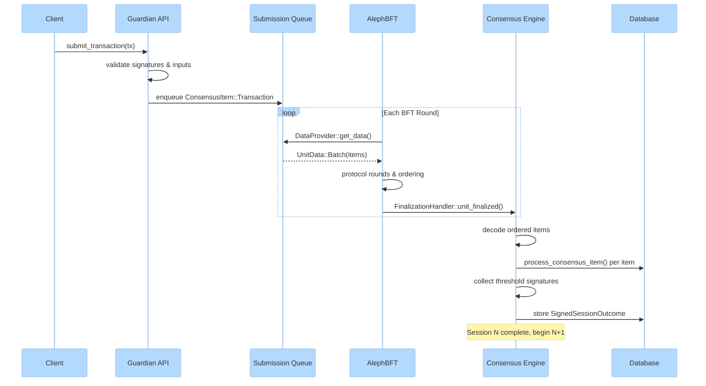
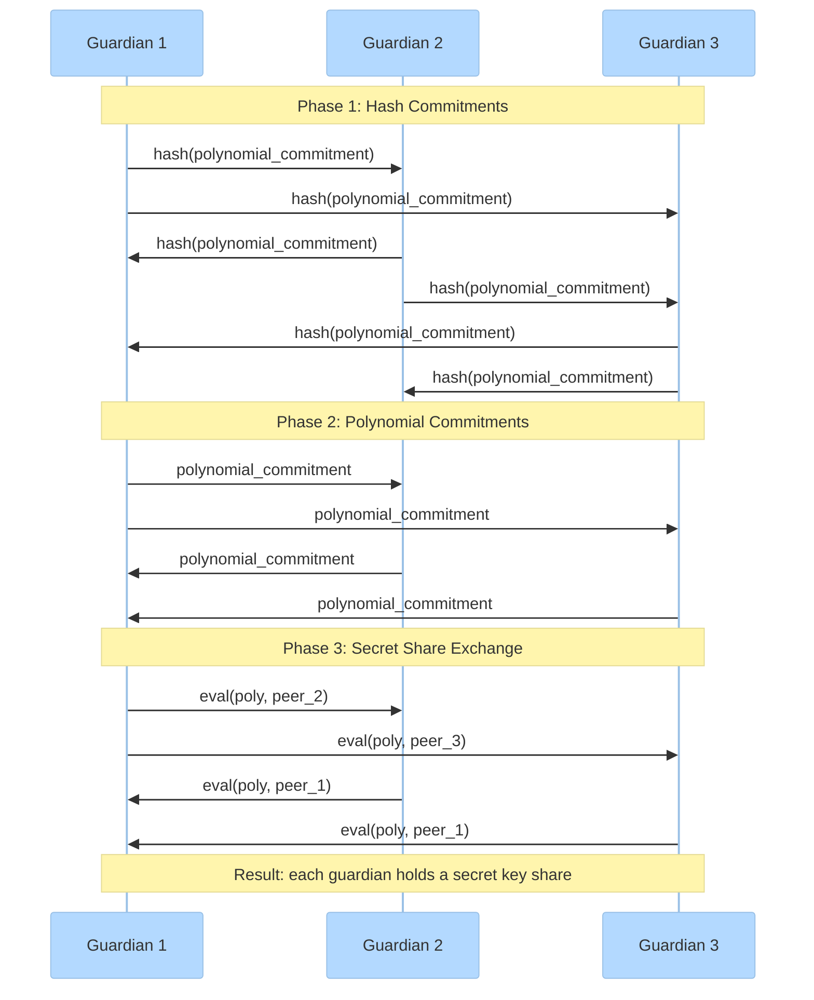

# Consensus

Fedimint uses [AlephBFT](https://docs.rs/aleph-bft/latest/aleph_bft/) for Byzantine fault-tolerant consensus. The system is **session-based**: guardians process items in sequential sessions, each producing a cryptographically signed outcome agreed upon by a threshold of peers.

[Back to overview](README.md)

---

## Session Lifecycle



1. Clients submit transactions to the guardian API
2. After local validation, transactions are enqueued as `ConsensusItem`s
3. AlephBFT's `DataProvider` batches pending items into units (max 50KB each)
4. The BFT protocol orders units across all peers in multiple rounds
5. `FinalizationHandler` emits `OrderedUnit`s as they finalize
6. The consensus engine decodes and processes each item against the database
7. Peers exchange session signatures; a threshold over the Merkle root of the ordered outcome completes the session

---

## Key Structures

| Component | Location | Role |
|-----------|----------|------|
| `ConsensusEngine` | `fedimint-server/src/consensus/engine.rs` | Orchestrates sessions, drives AlephBFT |
| `ConsensusApi` | `fedimint-server/src/consensus/api.rs` | Receives client transactions, validates, enqueues |
| `Keychain` | `fedimint-server/src/consensus/aleph_bft/keychain.rs` | Schnorr signing/verification for BFT messages |
| `DataProvider` | `fedimint-server/src/consensus/aleph_bft/data_provider.rs` | Batches `ConsensusItem`s into BFT units |
| `FinalizationHandler` | `fedimint-server/src/consensus/aleph_bft/finalization_handler.rs` | Emits ordered units on finalization |
| `Network` | `fedimint-server/src/consensus/aleph_bft/network.rs` | Routes `P2PMessage::Aleph` between peers |

---

## ConsensusItem

Every proposal entering consensus is a `ConsensusItem` (`fedimint-core/src/epoch.rs`):

```rust
pub enum ConsensusItem {
    Transaction(Transaction),              // user-initiated value transfer
    Module(DynModuleConsensusItem),        // module-specific contribution
    Default { variant: u64, bytes: Vec<u8> }, // forward-compatibility
}
```

- **Transaction**: the primary item type -- a balanced set of module inputs and outputs (see [Transaction Processing](#transaction-processing) below)
- **Module**: module-contributed data produced by `ServerModule::consensus_proposal()`, e.g. Bitcoin block height updates from the wallet module
- **Default**: catch-all for unknown variants, enabling forward compatibility across federation versions

---

## Session Timing

Sessions use configurable round limits with exponential slowdown:

```
delay = base_delay * 1.02^(round - rounds_per_session)
```

After the round limit, delays grow exponentially (capped at ~10 years), preventing resource waste in idle federations. A random jitter of 0.5x-1.5x is applied to each delay to desynchronize peers.

---

## ConsensusEngine Flow

`ConsensusEngine::run_consensus()` (`engine.rs:156`) is the top-level loop:

```
loop {
    session_index = get_finished_session_count()
    run_session(connections, session_index)
    // session complete, increment and continue
}
```

Within `run_session()`:
1. AlephBFT spawned with `Keychain`, `DataProvider`, `FinalizationHandler`, `Network`
2. `DataProvider::get_data()` drains the submission queue into `UnitData::Batch` payloads
3. After all rounds complete, `DataProvider` switches to emitting `UnitData::Signature` for session signing
4. `complete_signed_session_outcome()` processes all ordered items and collects peer signatures
5. Session outcome stored as `SignedSessionOutcome` (8-byte session index + 32-byte Merkle root + threshold signatures)

---

## Transaction Processing

A `Transaction` (`fedimint-core/src/transaction.rs`) is a balanced transfer of value through module inputs and outputs:

```rust
pub struct Transaction {
    pub inputs: Vec<DynInput>,
    pub outputs: Vec<DynOutput>,
    pub nonce: [u8; 8],
    pub signatures: TransactionSignature,
}
```

### Processing Pipeline

```mermaid
%%{init: {'theme': 'base', 'themeVariables': {'primaryColor': '#b3d9ff', 'secondaryColor': '#ffd6b3', 'tertiaryColor': '#d4f5d4', 'primaryTextColor': '#333', 'lineColor': '#666'}}}%%
flowchart LR
    subgraph Validation["Validation"]
        V1["verify_input()<br/><i>stateless crypto check</i>"]
        V2["verify_input_submission()<br/><i>mempool policy</i>"]
        V3["validate_signatures()<br/><i>aggregate pubkeys</i>"]
    end

    subgraph Processing["Processing"]
        P1["process_input()<br/><i>spend inputs</i>"]
        P2["process_output()<br/><i>create outputs</i>"]
        P3["verify_funding()<br/><i>inputs >= outputs + fees</i>"]
    end

    TX["Transaction"] --> V1 --> V2 --> V3 --> P1 --> P2 --> P3 --> OK["Committed"]

    style TX fill:#d4e6f1,stroke:#85c1e9,color:#333
    style Validation fill:#fdebd0,stroke:#f5b041,color:#333
    style Processing fill:#d5f5e3,stroke:#82e0aa,color:#333
    style OK fill:#d5f5e3,stroke:#82e0aa,color:#333
```



Each input/output is dispatched to its owning module by `module_instance_id`. Steps:

1. **`verify_input()`** -- stateless cryptographic checks, parallelizable across inputs
2. **`verify_input_submission()`** -- submission-time-only mempool policy (e.g. double-spend checks)
3. **`validate_signatures()`** -- verify aggregate Schnorr signature over all input public keys
4. **`process_input()`** -- mark inputs as spent, returns `InputMeta` (amount + authorizing pubkey)
5. **`process_output()`** -- create outputs in module state, returns `TransactionItemAmounts`
6. **`verify_funding()`** -- ensures sum(inputs) >= sum(outputs) + sum(fees)

Core function: `process_transaction_with_dbtx()` in `fedimint-server/src/consensus/transaction.rs`. The entire pipeline runs within a single database transaction -- any failure rolls back all changes.

### Processing Modes

Transactions are processed in two modes:
- **`TxProcessingMode::Submission`** -- at API submission time, runs full validation including mempool policies. Uses `dbtx.ignore_uncommitted()` for read-only pre-validation.
- **`TxProcessingMode::Consensus`** -- during session processing, skips submission-only checks since the item has already been ordered by BFT.

---

## Distributed Key Generation (DKG)

Federation setup uses Pedersen DKG over BLS12-381 (`fedimint-server/src/config/dkg_g1.rs`):



1. Each guardian generates a random polynomial of degree `threshold - 1`
2. **Phase 1**: broadcast hash commitments (binding, prevents manipulation)
3. **Phase 2**: broadcast polynomial commitments (verifiable against hashes)
4. **Phase 3**: exchange secret shares via P2P (Shamir's Secret Sharing evaluated at peer indices)
5. **Result**: each guardian holds a secret key share; the aggregate public key is computable by all

The `DkgG1` struct tracks state across phases. A parallel `DkgG2` handles G2 group operations. These produce the threshold keys used for blind signatures (mint module), Bitcoin multisig (wallet module), and consensus authentication.
