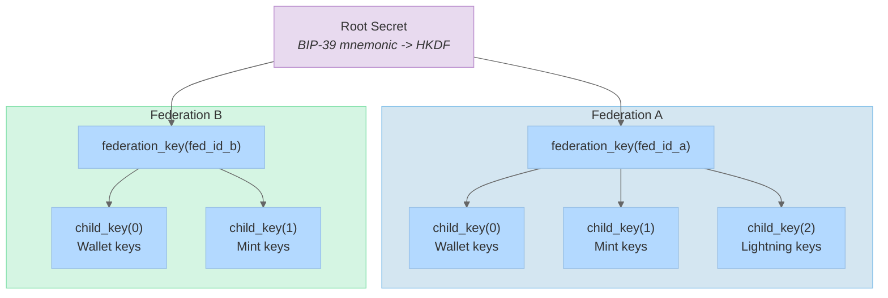

# Cryptography and Encoding

Fedimint uses custom consensus-critical binary encoding, hierarchical key derivation, and threshold cryptography. These primitives underpin transaction processing, module isolation, and backup/recovery.

[Back to overview](README.md)

---

## Consensus Encoding

Fedimint does **not** use serde for consensus-critical data. Instead, it uses custom `Encodable` / `Decodable` traits (`fedimint-core/src/encoding/mod.rs`) to guarantee byte-level determinism across all implementations.

### Traits

| Trait | Key Methods | Purpose |
|-------|-------------|---------|
| `Encodable` | `consensus_encode(writer)`, `consensus_encode_to_vec()`, `consensus_encode_to_hex()`, `consensus_hash_sha256()` | Deterministic binary serialization |
| `Decodable` | `consensus_decode_partial(reader, modules)`, `consensus_decode_whole(reader, modules)` | Deserialization with size limits (16MB max) and module registry |

### Module-Aware Decoding

All `Decodable::consensus_decode_*` methods receive a `ModuleDecoderRegistry`. This enables:

- **Forward compatibility**: when a module's decoder isn't available (e.g. a client doesn't know about a new module), the data is stored as raw bytes via `DynRawFallback<T>`
- **Lazy decoding**: raw bytes can be re-decoded later when the module becomes available
- **Version safety**: each module registers its own decoder, preventing cross-module type confusion

### Derive Macros

`#[derive(Encodable, Decodable)]` from `fedimint-derive` auto-implements encoding for structs and enums:

```rust
#[derive(Encodable, Decodable)]
pub struct Note {
    pub nonce: Nonce,
    pub signature: tbs::Signature,
}

#[derive(Encodable, Decodable)]
pub enum MintOutput {
    V0(MintOutputV0),
    #[encodable_default]
    Default { variant: u64, bytes: Vec<u8> },
}
```

The `#[encodable_default]` attribute on an enum variant captures unknown variants as raw bytes, enabling forward compatibility in consensus items.

### Built-in Implementations

Encoding is implemented for:
- Primitives: integers (little-endian), bools, byte arrays, strings
- Collections: `Vec`, `BTreeMap`, `BTreeSet`, `Option`, tuples (`fedimint-core/src/encoding/collections.rs`)
- Crypto types: secp256k1 keys/signatures, BLS12-381 points, `threshold_crypto` types
- Bitcoin types: `Transaction`, `BlockHash`, `Amount`, etc.

---

## Secret Derivation

All keys derive from a single BIP-39 mnemonic via `DerivableSecret` (`crypto/derive-secret/src/lib.rs`), using HKDF-SHA512.

### Key Hierarchy



### DerivableSecret

```rust
pub struct DerivableSecret {
    level: usize,         // derivation depth
    secret: HmacSha512,   // HKDF-SHA512 state
}
```

| Method | Purpose |
|--------|---------|
| `new_root(key, salt)` | Initialize root at level 0 |
| `federation_key(federation_id)` | Derive per-federation root (resets level to 0, prevents cross-federation key reuse) |
| `child_key(ChildId)` | Derive child key at level + 1 using tagged HKDF |
| `to_secp_key()` | Derive a secp256k1 keypair (Bitcoin) |
| `to_bls12_381_key()` | Derive a BLS12-381 scalar (threshold signatures) |
| `to_chacha20_poly1305_key()` | Derive a symmetric encryption key (backup encryption) |

The `Bip39RootSecretStrategy` generates a 12-word mnemonic and derives the root secret from it.

---

## Backup and Recovery

### Backup

1. Client creates a `ClientBackup` containing:
   - `session_count`: federation session index at backup time
   - `metadata`: application-specific data
   - Per-module `DynModuleBackup` snapshots
2. Serialized backup is padded to 4KB alignment
3. Encrypted with a deterministically-derived ChaCha20-Poly1305 key
4. Uploaded to the federation via a signed `BackupRequest` (ID + timestamp + payload)

### Recovery

```mermaid
%%{init: {'theme': 'base', 'themeVariables': {'primaryColor': '#b3d9ff', 'secondaryColor': '#ffd6b3', 'tertiaryColor': '#d4f5d4', 'primaryTextColor': '#333', 'lineColor': '#666'}}}%%
flowchart LR
    M["BIP-39 Mnemonic"] --> DK["Derive encryption key"]
    DK --> DL["Download encrypted backup<br/>from federation"]
    DL --> Dec["Decrypt backup"]
    Dec --> Restore["Restore module state<br/><i>session_count snapshot</i>"]
    Restore --> Replay["Replay federation sessions<br/><i>from backup point to now</i>"]
    Replay --> Done["Client recovered"]

    style M fill:#e8daef,stroke:#bb8fce,color:#333
    style DK fill:#e8daef,stroke:#bb8fce,color:#333
    style DL fill:#d4e6f1,stroke:#85c1e9,color:#333
    style Dec fill:#d4e6f1,stroke:#85c1e9,color:#333
    style Restore fill:#fdebd0,stroke:#f5b041,color:#333
    style Replay fill:#fdebd0,stroke:#f5b041,color:#333
    style Done fill:#d5f5e3,stroke:#82e0aa,color:#333
```



Key property: **deterministic e-cash derivation**. Since notes are derived from the root secret, they can be re-derived during recovery. The client replays federation consensus sessions from the backup point forward to discover which notes have been spent and reconstruct the current balance.

---

## Threshold Blind Signatures

The mint module uses threshold blind signatures (`crypto/tbs/`) over BLS12-381:

1. **Blinding**: Client blinds a nonce using a random blinding factor
2. **Signing**: Each guardian produces a signature share over the blinded nonce
3. **Combining**: Client collects threshold shares and combines into a full blind signature
4. **Unblinding**: Client removes the blinding factor, producing a valid signature on the original nonce
5. **Spending**: The `(nonce, signature)` pair is a spendable e-cash note. The federation verifies the signature without learning which guardian signed it or when.

This is the core of Chaumian e-cash: the federation can verify notes are authentic without being able to trace them back to the issuance transaction.

---

## Event Logging

The `fedimint-eventlog` crate provides an append-only event log with dual persistence modes:

| ID Type | Allocation | Use Case |
|---------|-----------|----------|
| `EventLogId` | Sequential (ordered) | Primary event stream |
| `UnorderedEventLogId` | Timestamp + counter (self-allocated) | Avoids DB transaction conflicts |

Events have three persistence levels:
- **Persistent**: kept forever
- **Trimable**: auto-deleted after 14 days or 10k IDs per operation
- **Transient**: runtime-only, not persisted

An ordering task periodically re-sequences unordered events into the ordered log. Events can be filtered by kind and joined for correlation.
