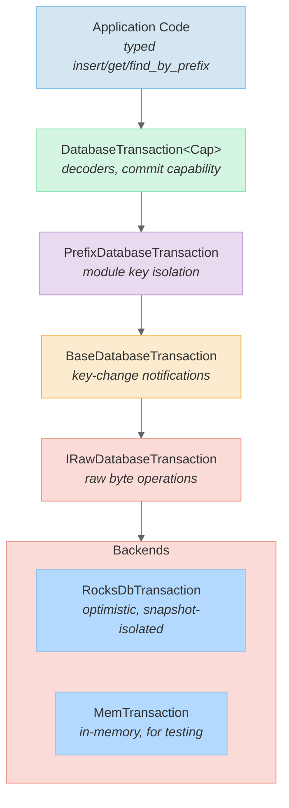

# Database

Fedimint uses an abstract key-value store with optimistic transactions, currently backed by RocksDB in production and an in-memory implementation for testing.

[Back to overview](README.md)

---

## Adapter Stack

The database is built from composable layers, each adding a specific concern:



---

## Core Traits

All defined in `fedimint-core/src/db/mod.rs`:

### Raw Layer (backend implementors)

| Trait | Methods | Purpose |
|-------|---------|---------|
| `IRawDatabase` | `begin_transaction()`, `checkpoint()` | Create snapshot-isolated transactions, backup |
| `IRawDatabaseTransaction` | extends `IDatabaseTransactionOps` + `commit_tx()` | Raw byte ops, atomic commit |

### Enhanced Layer (framework)

| Trait | Adds | Purpose |
|-------|------|---------|
| `IDatabase` | `register()`, `notify()`, `is_global()` | Key-change notification pub/sub |
| `IDatabaseTransaction` | `commit_tx()`, `global_dbtx()` | Commit + escape hatch to global namespace from module context |

### Operations

| Trait | Methods | Purpose |
|-------|---------|---------|
| `IDatabaseTransactionOps` | `raw_insert_bytes()`, `raw_get_bytes()`, `raw_remove_entry()`, `raw_find_by_prefix()`, `raw_find_by_prefix_sorted_descending()`, `raw_remove_by_prefix()` | Core CRUD + prefix scan |
| `IDatabaseTransactionOpsCoreTyped` | `insert()`, `get_value()`, `remove()`, `find_by_prefix()` | Typed wrappers using `Encodable`/`Decodable`, generic over anything implementing `IDatabaseTransactionOps` |

---

## Public API

### `Database`

Newtype over `Arc<dyn IDatabase>`, carrying a `ModuleDecoderRegistry`:

- `begin_transaction()` -- start a new `DatabaseTransaction<Committable>`
- `begin_transaction_nc()` -- start a non-committable transaction (read-only intent)
- `autocommit(tx_fn, max_attempts)` -- retry-on-conflict wrapper with automatic re-execution
- `with_prefix_module_id(id)` -- create a `PrefixDatabase` scoped to a module, returns `(Database, GlobalDBTxAccessToken)`

### `DatabaseTransaction<Cap>`

Generic over capability marker:
- `Cap = Committable` -- can call `commit_tx()`
- `Cap = NonCommittable` -- read-only borrow, cannot commit

Methods: all typed operations from `IDatabaseTransactionOpsCoreTyped`, plus:
- `to_ref_nc()` -- borrow as non-committable (lending to sub-functions)
- `commit_tx()` -- consume and commit (only on `Committable`)
- `on_commit(callback)` -- register post-commit side-effects

---

## Module Key Isolation

The `PrefixDatabase` adapter prepends a fixed byte prefix to all keys transparently:

```
Global data:      [entity_prefix][key_bytes...]
Module data:  [0xFF][module_id: 2 bytes LE][entity_prefix][key_bytes...]
```

For module instance ID 5:
```
[0xFF][0x05][0x00][entity_prefix][key_bytes...]
```

This ensures modules cannot read or write each other's data. The `global_dbtx()` escape hatch (gated by `GlobalDBTxAccessToken`) allows modules to access federation-wide state when necessary.

---

## Typed Keys and Values

Database records are defined with the `impl_db_record!` macro:

```rust
impl_db_record!(
    key = NoteNonceKey,       // struct implementing Encodable + Decodable
    value = (),
    db_prefix = DbKeyPrefix::NoteNonce,  // u8 entity prefix
    notify_on_modify = false,
);
```

This generates:
- `DatabaseRecord` impl with `DB_PREFIX`, `Key`, `Value` associated types
- Automatic key encoding: `[DB_PREFIX byte][consensus_encode(key_fields)]`
- Automatic value encoding: `consensus_encode(value)`
- Optional `DatabaseKeyWithNotify` marker when `notify_on_modify = true`

The `DatabaseKey` blanket impl prepends the prefix byte on encode and validates it on decode, returning `DecodingError::WrongPrefix` on mismatch.

---

## Optimistic Concurrency

RocksDB uses optimistic transactions with snapshot isolation:

1. A transaction sees a consistent snapshot taken at `begin_transaction()` time
2. Reads see snapshot state + any writes made within the same transaction
3. On `commit_tx()`, RocksDB checks for write-write conflicts (same key modified by another committed transaction since snapshot)
4. Conflicting commits fail; the caller retries

The `Database::autocommit()` helper automates this:

```rust
db.autocommit(|dbtx, _| {
    // read + write operations
    // automatically retried on conflict
}, Some(max_attempts)).await
```

---

## Notifications

A hash-based notification system (`fedimint-core/src/db/notifications.rs`) enables efficient key-change watching:

- **32 notification buckets** -- keys hash to buckets; multiple keys may share a bucket (false positives are acceptable)
- **`register(key)`** -- subscribe to changes on a key's bucket
- **`notify(key)`** -- broadcast after commit to all watchers of that bucket
- Uses `tokio::sync::Notify` with `notify_waiters()` for broadcast

### Watching Patterns

```rust
// Wait until a key satisfies a condition
dbtx.wait_key_check(&MyKey, |value| {
    value.filter(|v| v.is_ready())
}).await;

// Wait until a key exists
dbtx.wait_key_exists(&MyKey).await;
```

Only keys with `NOTIFY_ON_MODIFY = true` (set via `impl_db_record!`) trigger notifications. The watcher loop re-reads from the database after each notification, tolerating missed signals.

---

## Migrations

Migrations are per-module, defined in `ServerModuleInit::get_database_migrations()`:

```rust
fn get_database_migrations(&self) -> BTreeMap<DatabaseVersion, DbMigrationFn> {
    btreemap! {
        DatabaseVersion(0) => |ctx| Box::pin(migrate_v0_to_v1(ctx)),
        DatabaseVersion(1) => |ctx| Box::pin(migrate_v1_to_v2(ctx)),
    }
}
```

### How Migrations Run

1. `apply_migrations()` reads the current `DatabaseVersion` from `DatabaseVersionKey(module_id)`
2. Iterates from current version to target, running each migration function
3. Each migration commits atomically and increments the stored version
4. Missing versions log a warning (allows skipping no-op versions)

### Snapshot Testing

To catch accidental breaking changes:

1. `just prepare_db_migration_snapshots` -- creates database backups with dummy data for each module
2. `test_migrations` -- reads from these backups; if the data format has changed without a migration, the test fails
3. Intentional changes require regenerating snapshots (`just prepare_db_migration_snapshot` after updating)

Snapshots are stored in the `db/` directory at the repository root.

---

## Backend Implementations

### RocksDB (`fedimint-rocksdb/src/lib.rs`)

- Wraps `rocksdb::OptimisticTransactionDB`
- Snapshot isolation via `OptimisticTransactionOptions::set_snapshot(true)`
- Synchronous durability: `write_options.set_sync(true)`
- Blocking I/O wrapped in `block_in_place()` for async compatibility

### MemDatabase (`fedimint-core/src/db/mem_impl.rs`)

- Immutable `OrdMap<Vec<u8>, Vec<u8>>` with `RwLock`
- Snapshots by cloning the map at transaction start
- Supports read-your-own-writes via per-transaction copy
- Used for testing only (does not properly implement MVCC)
