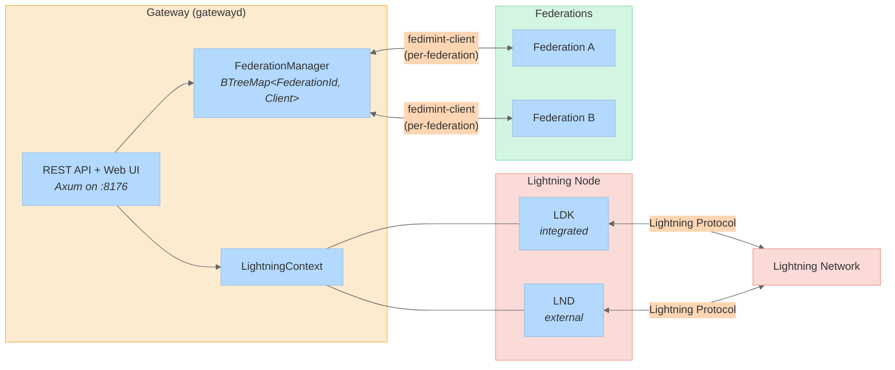
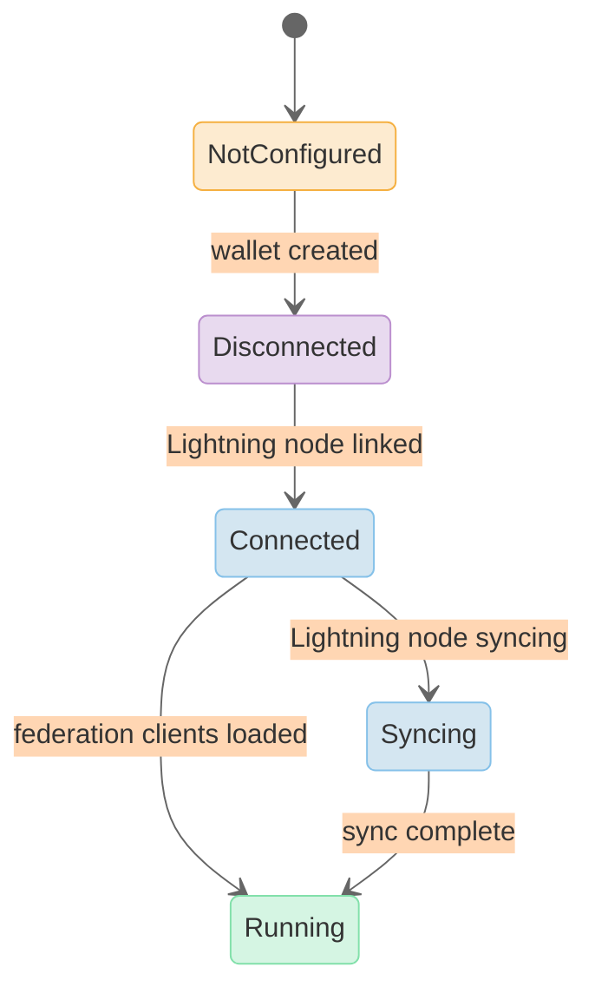
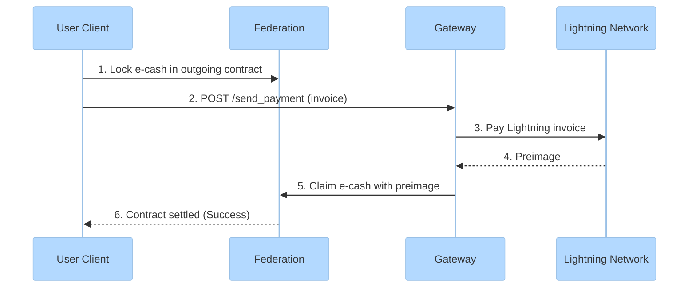
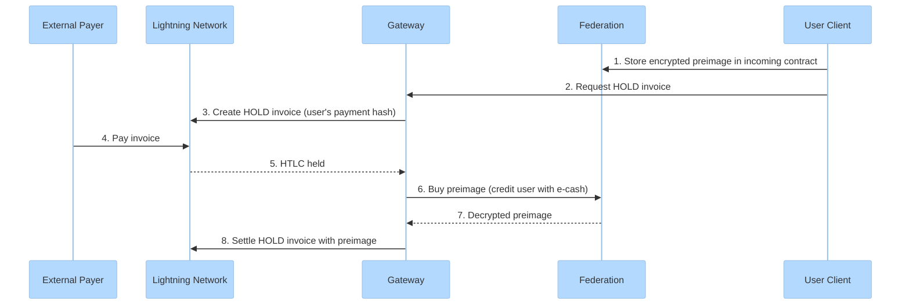

# Lightning Gateway

The Lightning Gateway bridges Fedimint federations to the Lightning Network, enabling users to send and receive Lightning payments using federated e-cash. A single gateway can serve multiple federations.

[Back to overview](README.md)

---

## Gateway Architecture

### Core Components

| Component | Location | Role |
|-----------|----------|------|
| `Gateway` | `gateway/fedimint-gateway-server/src/lib.rs` | Main struct, manages lifecycle and state transitions |
| `FederationManager` | `gateway/fedimint-gateway-server/src/federation_manager.rs` | Holds per-federation `Client` instances |
| `LightningContext` | `gateway/fedimint-gateway-server/src/` | Abstraction over LDK / LND backends |
| `GatewayClientModuleV2` | `gateway/fedimint-gwv2-client/src/lib.rs` | LNv2 client module for gateway-specific operations |
| REST API | `gateway/fedimint-gateway-server/src/` | Axum-based HTTP API + web UI |

---

## Gateway States

The gateway progresses through states during startup. It becomes fully operational in `Running`, at which point it can route Lightning payments for all connected federations.

---

## Lightning Backends

| Backend | Integration | Protocol Support |
|---------|------------|-----------------|
| **LDK** | Embedded (LDK Node library) | LNv2 only |
| **LND** | External (gRPC connection) | LNv1 + LNv2 |

LDK is the simpler, all-in-one option. LND supports legacy LNv1 (HTLC interception) in addition to LNv2.

---

## LNv2 Payment Flows

LNv2 uses **hold invoices** created by the gateway and **contracts** enforced by the federation. This is the current protocol (LNv1 is being deprecated).

### Outgoing Payment (User Pays Lightning Invoice)

**Client state machine** (`modules/fedimint-lnv2-client/src/send_sm.rs`):

| State | Trigger | Next State |
|-------|---------|------------|
| `Funding` | Transaction accepted by federation | `Funded` |
| `Funded` | Gateway returns preimage | `Success` |
| `Funded` | Timeout / gateway failure | `Refunding` |
| `Refunding` | Refund transaction accepted | Terminal |

The user locks e-cash into an outgoing contract enforced by the federation. The gateway pays the Lightning invoice and proves payment by presenting the preimage, which unlocks the e-cash. If the gateway fails or times out, the user reclaims their funds.

### Incoming Payment (User Receives Lightning Payment)

**Client state machine** (`modules/fedimint-lnv2-client/src/receive_sm.rs`):

| State | Trigger | Next State |
|-------|---------|------------|
| `Pending` | Incoming contract settled on-chain | `Claiming` |
| `Pending` | Contract expires | `Expired` |
| `Claiming` | Claim transaction accepted | Terminal (success) |

The user stores an encrypted preimage with the federation and gets a hold invoice from the gateway. When the invoice is paid, the gateway buys the preimage from the federation (crediting the user with e-cash) and uses it to settle the Lightning HTLC.

---

## Federation Manager

The `FederationManager` maintains a `BTreeMap<FederationId, ClientHandleArc>` -- one full Fedimint client per connected federation. Each client instance:

- Has its own database namespace
- Runs its own state machine executor
- Has gateway-specific client modules (`GatewayClientModuleV2`) registered
- Maintains an independent e-cash balance

The gateway also tracks an `index_to_federation` mapping for LNv1 short channel IDs, enabling legacy HTLC interception routing.

---

## Gateway API

The gateway exposes an Axum-based REST API:

| Endpoint | Purpose |
|----------|---------|
| `/send_payment` | Pay a Lightning invoice on behalf of a federation user |
| `/create_bolt11_invoice` | Create a hold invoice for incoming payments |
| `/routing_info` | Return gateway routing fees and capabilities |
| Web UI (`:8176`) | Management dashboard for operators |

Communication between clients and gateways uses the same transport layer as client-federation communication (WS, Iroh, HTTP), configured via the `ConnectorRegistry`.

---

## LNv1 vs LNv2

| Aspect | LNv1 | LNv2 |
|--------|------|------|
| Gateway registration | Automatic (permissionless) | Requires guardian approval |
| Invoice creation | By client | By gateway |
| Backend support | LND only | LND + LDK |
| Payment detection | HTLC interception | Hold invoices |
| Status | Deprecated | Active |

LNv2's hold-invoice approach is cleaner and supports both Lightning backends. LNv1 required intercepting all HTLCs at the LND level, which only works with LND and doesn't require explicit gateway registration. New deployments should use LNv2.
