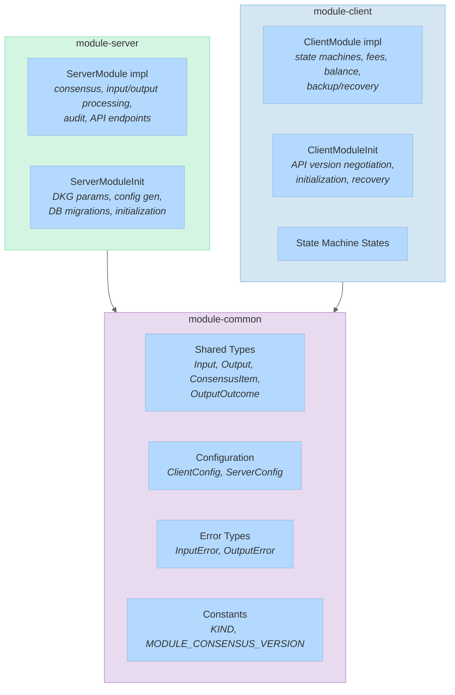

# Module System

Modules are the primary extension mechanism in Fedimint. Each module defines its own transaction input/output types, consensus contributions, API endpoints, client state machines, and database schema. The framework handles routing, isolation, and lifecycle.

[Back to overview](README.md)

---

## Three-Crate Pattern

Every module is split into three crates with clear responsibilities:



| Crate | Depends on | Contains |
|-------|-----------|----------|
| `module-common` | `fedimint-core` | Types shared between client and server: inputs, outputs, consensus items, configs, errors |
| `module-server` | `module-common`, `fedimint-server-core` | `ServerModule` + `ServerModuleInit` implementations |
| `module-client` | `module-common`, `fedimint-client-module` | `ClientModule` + `ClientModuleInit` implementations, state machines |

---

## ServerModule Trait

Defined in `fedimint-server-core/src/lib.rs`. This is what a module implements to participate in federation consensus:

```rust
pub trait ServerModule: Debug + Sized {
    type Common: ModuleCommon;
    type Init: ServerModuleInit;

    // --- Consensus ---
    fn consensus_proposal(&self, dbtx) -> Vec<ConsensusItem>;
    fn process_consensus_item(&self, dbtx, item, peer_id) -> Result<()>;

    // --- Transaction processing ---
    fn verify_input(&self, input) -> Result<(), InputError>;           // stateless
    fn process_input(&self, dbtx, input, in_point) -> Result<InputMeta>;  // transactional
    fn process_output(&self, dbtx, output, out_point) -> Result<TransactionItemAmounts>;

    // --- Submission policies ---
    fn verify_input_submission(&self, dbtx, input) -> Result<()>;
    fn verify_output_submission(&self, dbtx, output) -> Result<()>;

    // --- Introspection ---
    fn audit(&self, dbtx, audit, module_instance_id);
    fn api_endpoints(&self) -> Vec<ApiEndpoint<Self>>;
}
```

Key design points:
- `verify_input()` is **stateless** and can run in parallel -- pure cryptographic checks
- `process_input()` / `process_output()` are **transactional** -- they read/write the database
- `consensus_proposal()` is called periodically (not latency-critical) to gather module contributions
- `process_consensus_item()` returns `Err` only if the item is redundant (already processed)
- `audit()` reports assets and liabilities for the federation's balance audit

---

## ServerModuleInit Trait

Defined in `fedimint-server-core/src/init.rs`. Handles module lifecycle:

| Method | Purpose |
|--------|---------|
| `trusted_dealer_gen()` | Generate configs in trusted-dealer mode (testing) |
| `distributed_gen()` | Participate in distributed key generation |
| `validate_config()` | Verify config consistency |
| `get_client_config()` | Extract client-facing config from server config |
| `get_database_migrations()` | Return ordered migration functions |
| `used_db_prefixes()` | Declare database prefix bytes (collision detection) |
| `init()` | Create module instance from config and args |

---

## ClientModule Trait

Defined in `fedimint-client-module/src/module/mod.rs`. Client-side module behavior:

```rust
pub trait ClientModule: Debug + Sized {
    type Common: ModuleCommon;
    type Init: ClientModuleInit;
    type Backup;
    type ModuleStateMachineContext;
    type States: State;

    fn context(&self) -> Self::ModuleStateMachineContext;
    fn input_fee(&self, amount, input) -> Option<Amounts>;
    fn output_fee(&self, amount, output) -> Option<Amounts>;

    // --- Primary module (e-cash balance) ---
    fn supports_being_primary() -> PrimaryModuleSupport;
    fn create_final_inputs_and_outputs() -> ...;
    fn await_primary_module_output() -> ...;
    fn get_balance() -> Amount;
    fn subscribe_balance_changes() -> BoxStream;

    // --- Lifecycle ---
    fn start(&self);
    fn backup(&self) -> Self::Backup;
    fn leave(&self, dbtx) -> Result<()>;

    // --- Commands ---
    fn handle_cli_command(&self, args) -> ...;
    fn handle_rpc(&self, method, params) -> ...;
}
```

The **primary module** concept: exactly one module (typically Mint) acts as the "wallet" that holds the user's spendable balance. It implements `create_final_inputs_and_outputs()` to balance transactions by adding change inputs/outputs.

---

## ClientModuleInit Trait

Defined in `fedimint-client-module/src/module/init.rs`:

| Method | Purpose |
|--------|---------|
| `supported_api_versions()` | Declare compatible API versions for negotiation |
| `init()` | Create client module instance |
| `recover()` | Restore module state from backup + federation replay |

---

## Module Instance Isolation

Each module instance gets a unique `ModuleInstanceId` (u16), stored alongside a `ModuleKind` string (e.g. `"mint"`, `"wallet"`, `"lnv2"`) in the `ModuleRegistry`:

```rust
pub type ModuleInstanceId = u16;

pub struct ModuleRegistry<M, State = ()> {
    inner: BTreeMap<ModuleInstanceId, (ModuleKind, M)>,
}
```

Isolation is enforced at multiple levels:
- **Database**: all module keys are prefixed with `[0xFF][instance_id: 2 bytes]` (see [database.md](database.md))
- **Consensus**: `DynModuleConsensusItem` carries the instance ID, routing items to the correct module
- **Transactions**: `DynInput` / `DynOutput` carry `module_instance_id`, dispatching to the owning module
- **Decoders**: `ModuleDecoderRegistry` maps instance IDs to type decoders for deserialization

A reserved `MODULE_INSTANCE_ID_GLOBAL = u16::MAX` is used for federation-wide DKG operations.

---

## Built-in Modules

| Module | Kind | Crates | Purpose |
|--------|------|--------|---------|
| **Mint** | `"mint"` | `modules/fedimint-mint-{common,client,server}` | Chaumian e-cash with threshold blind signatures. Issues and redeems `Note`s backed by `BlindNonce` outputs. The default primary module. |
| **Wallet** | `"wallet"` | `modules/fedimint-wallet-{common,client,server}` | Bitcoin on-chain peg. Processes `PegInProof` inputs (deposit) and `PegOut` outputs (withdrawal). Tracks Bitcoin block height via consensus. |
| **LNv2** | `"lnv2"` | `modules/fedimint-lnv2-{common,client,server}` | Lightning payments via gateway hold invoices. Manages outgoing/incoming contracts. See [gateway.md](gateway.md). |
| **LN (v1)** | `"ln"` | `modules/fedimint-ln-{common,client,server}` | Legacy Lightning via HTLC interception (LND only). Being deprecated in favor of LNv2. |
| **Meta** | `"meta"` | `modules/fedimint-meta-{common,client,server}` | Federation metadata consensus (name, description, gateway list, etc.). |

### Mint Module Example

The mint module illustrates the pattern concretely:

**Common** (`modules/fedimint-mint-common/src/lib.rs`):
- `MintInput` / `MintOutput` / `MintConsensusItem` / `MintOutputOutcome`
- `Note`, `Nonce`, `BlindNonce` cryptographic types
- `MintClientConfig`, `MintConfig`
- `KIND = "mint"`, `MODULE_CONSENSUS_VERSION = (2, 0)`

**Server** (`modules/fedimint-mint-server/src/lib.rs`):
- `Mint` struct: holds `cfg: MintConfig`, tiered secret/public key shares
- Implements `ServerModule` for blind signature issuance and note validation
- DB tables: `NoteNonce`, `BlindNonce`, `MintAuditItem`, `OutputOutcome`

**Client** (`modules/fedimint-mint-client/src/lib.rs`):
- `MintClientModule` struct
- State machines for note request/issuance lifecycle
- Balance tracking, backup, recovery via `recover_from_slices()`

---

## Adding a New Module

1. Create three crates following the naming convention `fedimint-<name>-{common,client,server}`
2. Define input/output/consensus types in `common`, implementing `Encodable`/`Decodable`
3. Implement `ServerModule` + `ServerModuleInit` in `server`
4. Implement `ClientModule` + `ClientModuleInit` in `client`
5. Register the module with the server/client at startup
6. Add database migrations in `get_database_migrations()`
7. Add integration tests in a `fedimint-<name>-tests` crate

See also: `docs/building-new-modules.md` in the repository.
